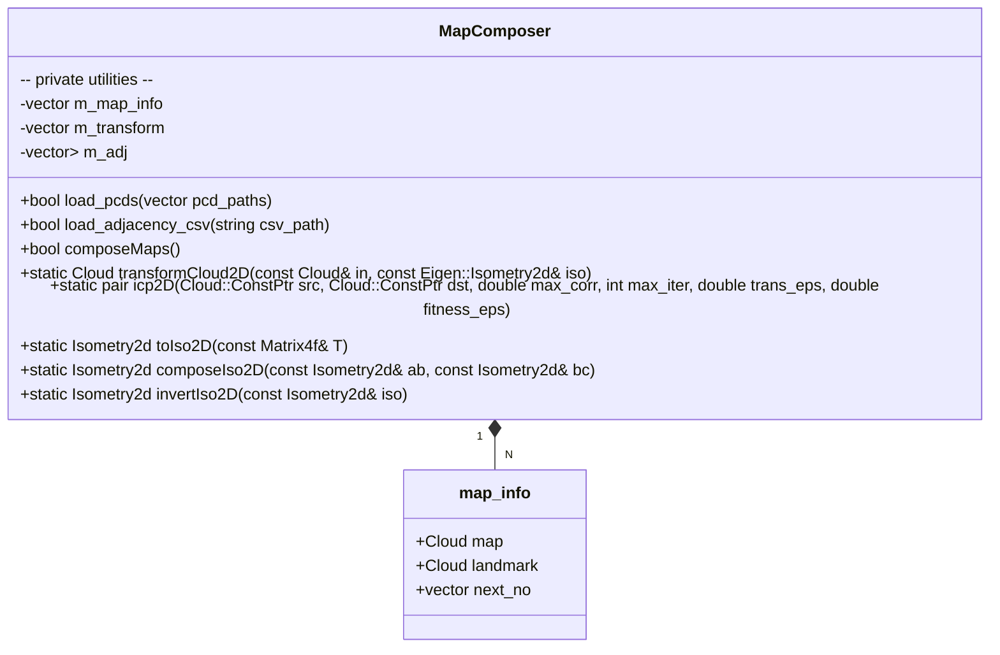
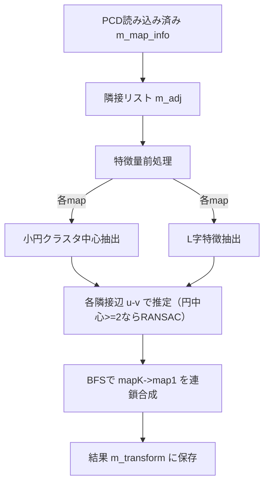

# C++版 map_composer 詳細設計

本書は `doc/map_composer_to_ROS_input.md` の要件に基づく C++ 実装（PCL + Eigen）版 map_composer の詳細設計である。ライブラリ本体は `cpp/` 配下に実装し、主インタフェースは `MapComposer` クラスで提供する。

- 目的: 複数の2D点群マップ（各PCD）を基準座標系（map1）へ統合する2D剛体変換（Isometry2d）を推定する。
- 想定データ: 円型（多数の小円の集合）またはL字型（2直線の交点を含む）で、データセット内は単一タイプ。
- 依存: PCL 1.8+（io, common, registration）、Eigen3（Isometry2d）。

## クラス（関数）図

補助的な内部関数（無名名前空間に実装）
- L字関連  
  - `detectLFeatures(const Cloud&) -> vector<LFeat>`: PCA＋反復割当で L 形状を抽出  
  - `estimateFromL(const LFeat&, const LFeat&) -> Isometry2d`: 腕方向の整合から単一候補を算出  
  - `generateLCandidates(const LFeat&, const LFeat&) -> vector<Isometry2d>`: 単一直交対の向き曖昧性（±180°）を列挙  
  - `endpointScore(...) -> double`: 変換後の端点整合度を算定  
  - `estimateFromLs(...) -> Isometry2d`: 複数 L 特徴を持つ場合の総合的な候補評価  
  - `chooseBestLPair(...) -> pair<int,int>`: 単一 L ケース向けの最適ペア選択
- 円形ランドマーク  
  - `detectCircleCenters(const Cloud&) -> vector<Vector2d>`: ε 近傍クラスタリング＋Kasa 法で中心抽出  
  - `estimateFromCircleCenters(const vector<Vector2d>&, const vector<Vector2d>&) -> Isometry2d`: 2点RANSAC→Procrustes
- 共通ユーティリティ  
  - `pointLineDistance`, `pointsAlignmentMSE`, `robustMSEToTarget`  
  - `edgeKey`, `composeIso2D`, `invertIso2D`

## データ構造
- `using Point = pcl::PointXYZI; using Cloud = pcl::PointCloud<Point>;`
- `struct map_info { Cloud map; Cloud landmark; vector<int> next_no; };`
- `struct LFeat { lc, p01,d1, p02,d2, l1,l2, ldeg, e1a,e1b,e2a,e2b }`
  - `m_map_info`: 入力マップ（PCD）を保持
  - `m_transform`: `map_i -> map1` の変換 `Eigen::Isometry2d` を保持
  - `m_adj`: 隣接行列の隣接リスト（無向グラフ）

## 関数仕様（入出力）
- `bool load_pcds(const vector<string>& pcd_paths)`
  - 入力: PCDファイルパス列（例: `.../map1.pcd`, `map2.pcd`, ...）
  - 出力: 成功可否（true: すべて読み込み成功）
  - 例外/エラー: 読み込み失敗時はfalse返却・stderrへログ

- `bool load_adjacency_csv(const string& csv_path)`
  - 入力: 隣接行列CSV（0/1, 正方）
  - 出力: 成功可否（true: 読み込み・形状妥当）
  - 処理: 正方性チェック、`m_adj` 構築、`m_map_info[i].next_no` を同期

- `bool composeMaps()`
  - 入力: なし（メンバ `m_map_info`, `m_adj` を使用）
  - 出力: 実行成功可否（現実装は処理完了でtrue。特徴量ベースのため「収束」の概念は使用しない）
  - 副作用: `m_transform[i]` に `map_i -> map1` の `Isometry2d` を格納

- `static Cloud transformCloud2D(const Cloud& in, const Isometry2d& iso)`
  - 入力: 入力点群（XY使用, Zはそのまま）, 2D同次変換
  - 出力: 変換済み点群（XYのみ変換, Z保持）

- `static pair<bool, Matrix4f> icp2D(...)`（デバッグ/代替用途）
  - 入力: src, dst 点群, ICPパラメータ
  - 出力: 収束可否と `4x4` 変換行列
  - 備考: 2D用途のため最終的に `toIso2D` で XY 成分に射影

- `static Isometry2d toIso2D(const Matrix4f& T)`, `composeIso2D(...)`, `invertIso2D(...)`
  - 入出力: それぞれ行列→2D同次、合成、反転のユーティリティ

## アルゴリズム詳細

### 全体フロー（composeMaps）

1) 特徴量抽出（円型）
- ε = 0.12 m の近傍グラフで連結成分を抽出
- 各クラスタに Kasa 法を適用し、半径 `R∈[0.015,0.05]` かつ正規化残差 `resn < 0.08` の場合に円中心を採用

2) 特徴量抽出（L字型）
- PCA で主成分 `d1` を初期化し、点群を「線1」「線2」に分類（10分位・90分位を初期クラスタ中心に使用）
- 最近傍線への割当→PCAによる再フィットを最大6回反復し、直交する2直線を推定
- 投影区間 `[tmin, tmax]` から腕長 `l1, l2` を算出し、角度 `ldeg` が20°以上、端点が区間端の50%以内にある場合のみ受理
- 腕長の長い直線を line1 に正規化し、各方向ベクトルは交点から遠い端点に向くよう符号を調整

3) 隣接辺ごとの初期変換推定
- 円中心が双方で2点以上: 2点RANSAC（300反復）で仮説生成→対応割当→Procrustes で最終変換を復元
- L字:
  - 複数 L を持つ場合: `estimateFromLs` が端点整合、ロバストMSE、インライア数を組み合わせて最良候補を決定
  - 単一 L の場合: `chooseBestLPair` でペアを決定後、`generateLCandidates` の2候補を端点整合→全点ロバスト誤差→角点近傍誤差→インライアの順で評価
- どちらの特徴も利用できない場合は `icp2D`（max_corr=2.0）で代替推定

4) BFS による参照（map1）への連鎖合成とグローバル整合
- 根を map1 とし、`edgeKey` で識別した `v->u` 候補群から `robustMSEToTarget` により訪問済み点群との整合が最良なものを選択
- 各ノードの変換は `composeIso2D` で連鎖合成
- BFS完了後、各ノードについて重心回りの180°回転候補を評価し、ロバスト誤差が改善する場合のみ置き換える

### 数式・変換仕様
- 2D回転行列 `R(θ) = [[cosθ, -sinθ],[sinθ, cosθ]]`
- 座標変換 `p1 = R p + t`（`map_i -> map1`）
- 角度表現: `θ = atan2(R(1,0), R(0,0)) [deg]`

### 主要パラメータ（既定）
- 円クラスタ ε: `0.12 m`
- 円残差許容: `resn < 0.08`、半径範囲: `[0.015, 0.05] m`
- RANSAC: 反復 `300`、インライア閾値 `0.15 m`
- L抽出: 反復 `6`、各クラスタ最小点数 `>= max(20, 2*min_samples)`
- 端点整合の重み付け: 単一Lでは端点整合を最優先、複数Lでは端点整合はタイブレークに使用

## 計算量の目安
- 円クラスタリング: `O(N^2)`（近傍探索を全ペアで評価）
- 円当てはめ: 各クラスタで `O(M)` の線形最小二乗
- L抽出: PCA（SVD）と距離計算を複数回実施（総じて `O(M^2)` 以内）
- RANSAC: 反復300回 × 対応探索（中心点数に依存）
- BFS: 辺数 `|E|` に線形

## 例外・エラー処理
- PCD/CSV 読み込み失敗: false を返し、標準エラーへログ出力
- 特徴抽出失敗（単一マップ）: 可能な方法（円/Ｌいずれか）で推定し、それも不可の場合は隣接辺の推定をスキップ
- 現実装の `composeMaps()` は処理完了で true を返す（収束概念は未使用）。必要に応じて「全辺での推定成功」のbool集約に変更可能

## 拡張ポイント
- ICP による微調整（現在はデバッグ用途のユーティリティを実装済）
- 円/Lの混在判定・自動切替（現実装は辺ごとに円中心>=2なら円ベース、さもなくばＬベース）
- 外れ値に対する更なるロバスト化（M-estimator、角度・長さの事前分布）
- 3D対応（Z成分の処理、平面射影）

## 利用手順（要約）
- ビルド: `cmake -S cpp -B build && cmake --build build -j`
- 実行: `./build/map_composer_cli --pcd-dir data/pcd/<circle|L> --adj data/adj.csv --write-out out/<dir>`
- 出力: 標準出力に `mapK -> map1: t=(tx, ty), theta_deg=θ`、変換済みPCD（任意）

## 妥当性確認
- `data/pcd/circle`: ドキュメントの期待変換と一致（`doc/validation_cpp.md` 参照）。`out/circle_refactor.png` で重畳結果を確認。
- `data/pcd/L`: map2→map1, map3→map1 ともに（-75°, +20°）へ収束し、`out/L_refactor.png` に可視化を保存。
