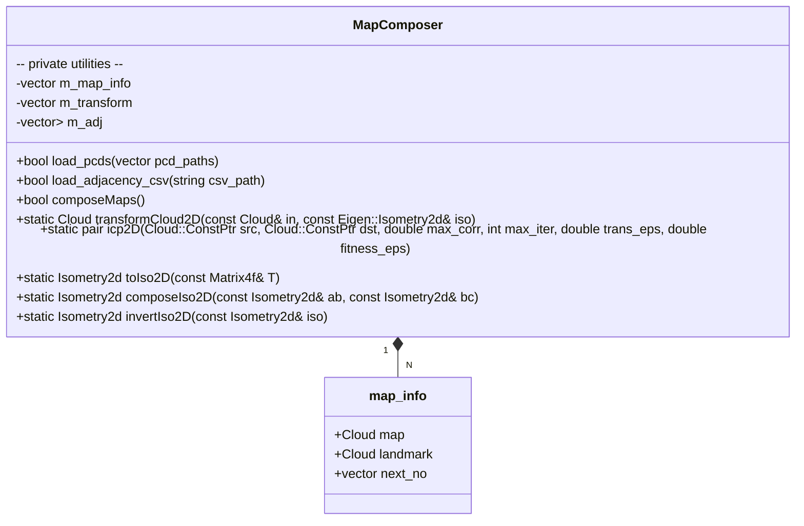
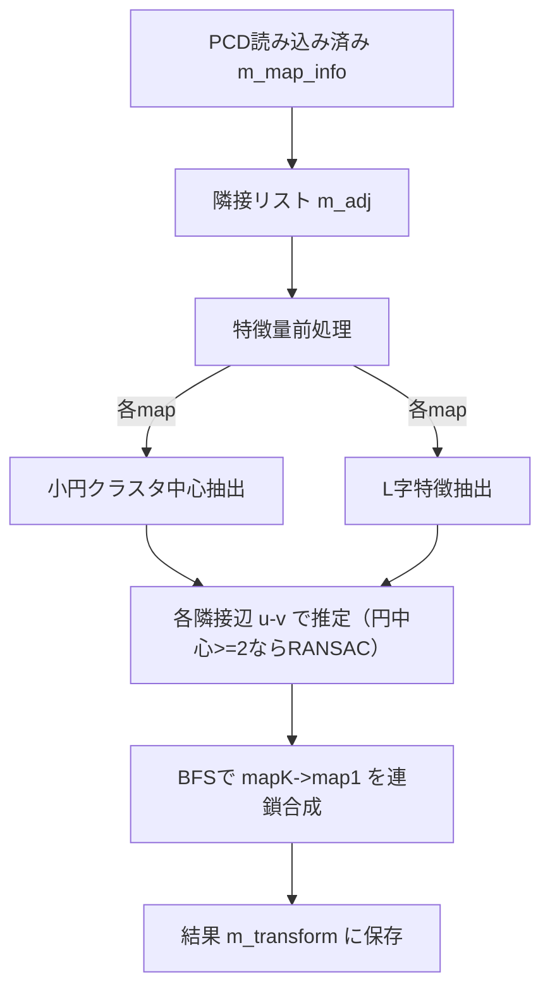

# C++版 map_composer 詳細設計

本書は `doc/map_composer_to_ROS_input.md` の要件に基づく C++ 実装（PCL + Eigen）版 map_composer の詳細設計である。ライブラリ本体は `cpp/` 配下に実装し、主インタフェースは `MapComposer` クラスで提供する。

- 目的: 複数の2D点群マップ（各PCD）を基準座標系（map1）へ統合する2D剛体変換（Isometry2d）を推定する。
- 想定データ: 円型（多数の小円の集合）またはL字型（2直線の交点を含む）で、データセット内は単一タイプ。
- 依存: PCL 1.8+（io, common, registration）、Eigen3（Isometry2d）。

## クラス（関数）図

補助的な内部関数（無名関数/ローカル関数として実装）
- 円中心抽出: `extract_circle_centers(const Cloud&) -> vector<Vector2d>`
- 円中心からの剛体推定: `estimate_from_centers(const vector<Vector2d>& S, const vector<Vector2d>& D) -> Isometry2d`
- L字特徴抽出: `extract_L_features(const Cloud&) -> vector<LFeat>`（2直線分解＋交点＋端点抽出）
- L字からの剛体推定: `estimate_from_L(const LFeat& s, const LFeat& d) -> Isometry2d`（単一候補）
- L字の候補列挙: `estimate_from_L_candidates(const LFeat& s, const LFeat& d) -> vector<Isometry2d>`（line1→line1 / line1→line2）
- 端点整合スコア: `endpoint_score(const LFeat& s, const LFeat& d, const Isometry2d& iso) -> double`

## データ構造
- `using Point = pcl::PointXYZI; using Cloud = pcl::PointCloud<Point>;`
- `struct map_info { Cloud map; Cloud landmark; vector<int> next_no; };`
- `struct LFeat { lc, p01,d1, p02,d2, l1,l2, ldeg, e1a,e1b,e2a,e2b }`
  - `m_map_info`: 入力マップ（PCD）を保持
  - `m_transform`: `map_i -> map1` の変換 `Eigen::Isometry2d` を保持
  - `m_adj`: 隣接行列の隣接リスト（無向グラフ）

## 関数仕様（入出力）
- `bool load_pcds(const vector<string>& pcd_paths)`
  - 入力: PCDファイルパス列（例: `.../map1.pcd`, `map2.pcd`, ...）
  - 出力: 成功可否（true: すべて読み込み成功）
  - 例外/エラー: 読み込み失敗時はfalse返却・stderrへログ

- `bool load_adjacency_csv(const string& csv_path)`
  - 入力: 隣接行列CSV（0/1, 正方）
  - 出力: 成功可否（true: 読み込み・形状妥当）
  - 処理: 正方性チェック、`m_adj` 構築、`m_map_info[i].next_no` を同期

- `bool composeMaps()`
  - 入力: なし（メンバ `m_map_info`, `m_adj` を使用）
  - 出力: 実行成功可否（現実装は処理完了でtrue。特徴量ベースのため「収束」の概念は使用しない）
  - 副作用: `m_transform[i]` に `map_i -> map1` の `Isometry2d` を格納

- `static Cloud transformCloud2D(const Cloud& in, const Isometry2d& iso)`
  - 入力: 入力点群（XY使用, Zはそのまま）, 2D同次変換
  - 出力: 変換済み点群（XYのみ変換, Z保持）

- `static pair<bool, Matrix4f> icp2D(...)`（デバッグ/代替用途）
  - 入力: src, dst 点群, ICPパラメータ
  - 出力: 収束可否と `4x4` 変換行列
  - 備考: 2D用途のため最終的に `toIso2D` で XY 成分に射影

- `static Isometry2d toIso2D(const Matrix4f& T)`, `composeIso2D(...)`, `invertIso2D(...)`
  - 入出力: それぞれ行列→2D同次、合成、反転のユーティリティ

## アルゴリズム詳細

### 全体フロー（composeMaps）

1) 特徴量抽出（円型）
- 近傍グラフ（ε=0.12m）で連結成分クラスタリング
- クラスタ毎に Kasa 法で円当てはめ（正則化: 残差 `resn < 0.08`、半径 `R∈[0.015, 0.05]`）
- 有効クラスタの円中心を特徴点として収集

2) 特徴量抽出（L字型）
- PCA で主方向 `d1` を推定し、点群を「line1近傍」と「それ以外」に分ける
- 「それ以外」にPCA適用で `d2` を初期化、以降は最近傍線への距離で割当→PCA再フィットを反復（6回）
- 2直線の交点 `lc`、各線の投影区間 `[tmin, tmax]` から腕長 `l1, l2` を算出（交点からの最大距離）
- 角度 `ldeg = acos(|d1·d2|)`、端点相対距離≤0.5、各腕長≥0.2m を満たす場合にLとして受理
- 腕長の長い直線を line1 に正規化し、さらに `d1/d2` の符号を「交点から遠い端点側に向く」よう正規化
- 端点 `e1a,e1b,e2a,e2b` を保存（後段の端点整合評価に利用）

3) 隣接辺ごとの初期変換推定
- 円中心が両側で2点以上: 2点対応RANSAC（300反復）で仮説→最近傍一致でインライア評価→Procrustes で (R,t) 再推定
- L字：
  - 複数L: `estimate_from_L` の候補でインライア数→角点近傍のロバスト距離→MSEの優先で選択
  - 単一L: `estimate_from_L_candidates` による2候補を「端点整合スコア」を最優先に、次いで全点群ロバスト距離→角点近傍ロバスト距離→MSEの順に選択

4) BFS による参照（map1）への連鎖合成＋候補比較
- 根を map1(=index 0) とし、未訪問ノードに対して `v->1 = (v->u) o (u->1)` を適用
- 単一Lの辺では `v->u` の2候補を保持し、訪問済みノードを集約したターゲット点群に対するロバスト距離が小さい候補を採用
- 仕上げとして、各ノードの変換を重心回りに±180°反転した場合の全体ロバスト距離を比較し、改善する場合のみ反転採用（グローバル整合）

### 数式・変換仕様
- 2D回転行列 `R(θ) = [[cosθ, -sinθ],[sinθ, cosθ]]`
- 座標変換 `p1 = R p + t`（`map_i -> map1`）
- 角度表現: `θ = atan2(R(1,0), R(0,0)) [deg]`

### 主要パラメータ（既定）
- 円クラスタ ε: `0.12 m`
- 円残差許容: `resn < 0.08`、半径範囲: `[0.015, 0.05] m`
- RANSAC: 反復 `300`、インライア閾値 `0.15 m`
- L抽出: 反復 `6`、各クラスタ最小点数 `>= max(20, 2*min_samples)`
- 端点整合の重み付け: 単一Lでは端点整合を最優先、複数Lでは端点整合はタイブレークに使用

## 計算量の目安
- 円クラスタリング: `O(N^2)`（ペア距離, N=点数）
- 円当てはめ: クラスタごとに `O(M)`（線形最小二乗）
- L抽出: PCA（SVD）`O(M)〜O(M^2)` を数回、割当 `O(M)` を反復
- RANSAC: 反復数×対応計算（中心点数に依存）
- BFS: 辺数 `|E|` に線形

## 例外・エラー処理
- PCD/CSV 読み込み失敗: false を返し、標準エラーへログ出力
- 特徴抽出失敗（単一マップ）: 可能な方法（円/Ｌいずれか）で推定し、それも不可の場合は隣接辺の推定をスキップ
- 現実装の `composeMaps()` は処理完了で true を返す（収束概念は未使用）。必要に応じて「全辺での推定成功」のbool集約に変更可能

## 拡張ポイント
- ICP による微調整（現在はデバッグ用途のユーティリティを実装済）
- 円/Lの混在判定・自動切替（現実装は辺ごとに円中心>=2なら円ベース、さもなくばＬベース）
- 外れ値に対する更なるロバスト化（M-estimator、角度・長さの事前分布）
- 3D対応（Z成分の処理、平面射影）

## 利用手順（要約）
- ビルド: `cmake -S cpp -B build && cmake --build build -j`
- 実行: `./build/map_composer_cli --pcd-dir data/pcd/<circle|L> --adj data/adj.csv --write-out out/<dir>`
- 出力: 標準出力に `mapK -> map1: t=(tx, ty), theta_deg=θ`、変換済みPCD（任意）

## 妥当性確認
- `data/pcd/circle`: ドキュメントの期待変換と一致（`doc/validation_cpp.md` 参照）
- `data/pcd/L`: map2→map1, map3→map1 ともに（-75°, +20°）へ収束。`out/plots/pcd_L_overlay.png` にて重畳を確認。
